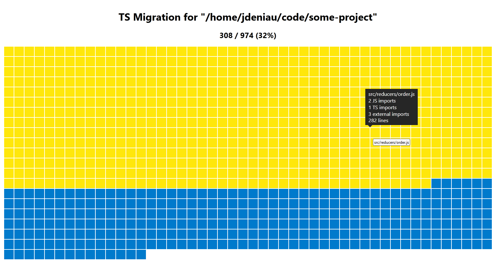

# TS Migration

A tool that list the remaining JS files and sort them for a migration to TS.



## How to run ?

Clone the project

```sh
git clone https://github.com/jdeniau/ts-migration.git
cd ts-migration
yarn install
```

Run the command

```sh
yarn build /path/to/project
```

If you want to list files on a subfolder of the project, you might pass a second argument

```sh
yarn build /path/to/project src
```

Open the file `public/index.html` in your browser.
